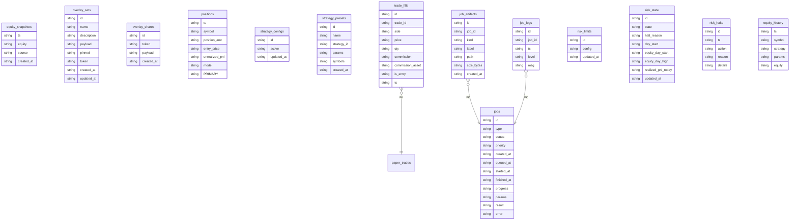

```mermaid
erDiagram
  jobs {
    string id
    string type
    string status
    string priority
    string created_at
    string queued_at
    string started_at
    string finished_at
    string progress
    string params
    string result
    string error
  }
  equity_snapshots {
    string ts
    string equity
    string source
    string created_at
  }
  overlay_sets {
    string id
    string name
    string description
    string payload
    string pinned
    string token
    string created_at
    string updated_at
  }
  overlay_shares {
    string id
    string token
    string payload
    string created_at
  }
  positions {
    string ts
    string symbol
    string position_amt
    string entry_price
    string unrealized_pnl
    string mode
    string PRIMARY
  }
  strategy_configs {
    string id
    string active
    string updated_at
  }
  strategy_presets {
    string id
    string name
    string strategy_id
    string params
    string symbols
    string created_at
  }
  trade_fills {
    string id
    string trade_id
    string side
    string price
    string qty
    string commission
    string commission_asset
    string is_entry
    string ts
  }
  job_artifacts {
    string id
    string job_id
    string kind
    string label
    string path
    string size_bytes
    string created_at
  }
  job_logs {
    string id
    string job_id
    string ts
    string level
    string msg
  }
  risk_limits {
    string id
    string config
    string updated_at
  }
  risk_state {
    string id
    string state
    string halt_reason
    string day_start
    string equity_day_start
    string equity_day_high
    string realized_pnl_today
    string updated_at
  }
  risk_halts {
    string id
    string ts
    string action
    string reason
    string details
  }
  equity_history {
    string ts
    string symbol
    string strategy
    string params
    string equity
  }
  trade_fills }o--|| paper_trades : FK
  job_artifacts }o--|| jobs : FK
  job_logs }o--|| jobs : FK
```
